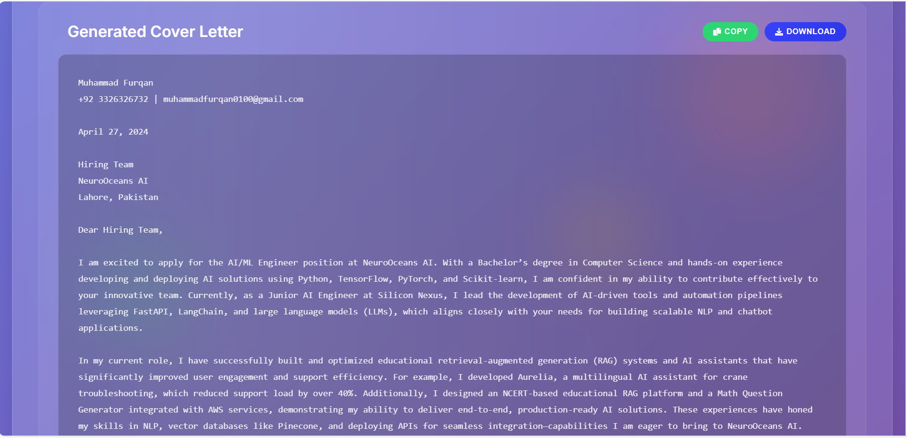

# 🚀 AI Resume Analyzer & Cover Letter Generator 🚀

This advanced web application leverages the power of Large Language Models (LLMs) to automatically analyze resumes, match them against job descriptions, and generate compelling, personalized cover letters. It features a modern, animated user interface and robust backend processing.



## ✨ Key Features

-   **🤖 AI-Powered Cover Letter Generation:** Uses GPT models (`gpt-4.1-mini`) to create tailored cover letters that highlight relevant skills and experience.
-   **📄 Resume Upload & Parsing:** Supports `.pdf`, `.docx`, and `.txt` file uploads, automatically extracting the text for analysis.
-   **🔍 Smart Resume Analysis:** An integrated API endpoint analyzes resume content, providing stats on word count, detected skills, and a readability score.
-   **Fallback Mechanism:** Includes a template-based cover letter generator that ensures functionality even if the OpenAI API is unavailable.
-   **Modern & Animated UI:** A beautiful "glassmorphism" interface built with dynamic JavaScript, featuring animated backgrounds, glowing orbs, and smooth transitions.
-   **Rich User Experience:** Includes interactive elements like tooltips, progress bars, word counters, and success notifications.
-   **📥 Download Functionality:** Allows users to download the generated cover letter as a `.txt` file.

## 📸 Application Showcase

Here's a glimpse of the application's interface and capabilities:

| Feature | Screenshot |
| :--- | :---: |
| **Main Interface** |  |
| **Generated Output** |  |

## 🛠️ How to Run

Follow these steps to get the application running locally:

1.  **Clone the Repository:**
    ```bash
    git clone https://github.com/iammuhammadfurqan/Resume_Analyzer.git
    cd Resume_Analyzer
    ```

2.  **Set Up a Virtual Environment** (Recommended):
    ```bash
    python -m venv venv
    source venv/bin/activate  # On Windows, use `venv\Scripts\activate`
    ```

3.  **Install Dependencies:**
    The project includes a `requirements.txt` file with all necessary packages.
    ```bash
    pip install -r requirements.txt
    ```

4.  **Configure Your Environment:**
    Create a `.env` file in the root of the project. This file will store your secret API key.
    ```
    OPENAI_API_KEY="YOUR_OPENAI_API_KEY"
    ```

5.  **Run the Application:**
    ```bash
    python app.py
    ```

6. **Open your browser:**
Navigate to `http://localhost:5000`

## 🔧 Configuration

### OpenAI API Setup

1. Visit [OpenAI Platform](https://platform.openai.com/)
2. Create an account or sign in
3. Navigate to API Keys section
4. Create a new API key
5. Add it to your `.env` file

### Environment Variables

| Variable | Description | Default |
|----------|-------------|---------|
| `OPENAI_API_KEY` | Your OpenAI API key | Required |
| `FLASK_ENV` | Flask environment | `production` |
| `FLASK_DEBUG` | Enable debug mode | `False` |

## 📂 Project Structure

```
.
├── app.py              # Main Flask application logic
├── requirements.txt      # Python dependencies
├── .env                  # For storing API keys (ignored by Git)
├── .gitignore            # Specifies files to be ignored by Git
├── static/
│   ├── style.css       # Main stylesheet for the UI
│   └── script.js       # JavaScript for frontend interactivity
├── templates/
│   └── index.html      # Main HTML template
├── uploads/              # Temporary storage for uploaded files (ignored by Git)
└── ss_images/
    └── ...             # Screenshots for the README
```

## 🎯 Usage

### Basic Usage

1. **Load Sample Data**: Click "Load Sample Data" to see how the tool works
2. **Enter Your Resume**: Paste your resume in the left textarea
3. **Enter Job Description**: Paste the job posting in the right textarea
4. **Analyze Resume** (Optional): Get insights about your resume
5. **Generate Cover Letter**: Click the main button to create your cover letter
6. **Copy or Download**: Use the action buttons to save your cover letter

### Resume Analysis Features

- **Word Count**: Tracks the length of your resume
- **Skill Detection**: Automatically identifies technical skills
- **Readability Score**: Provides a quality assessment
- **Suggestions**: Offers tips for improvement

### API Endpoints

- `GET /` - Main application page
- `GET /sample` - Load sample data
- `POST /generate` - Generate cover letter
- `POST /api/analyze` - Analyze resume (JSON API)

## 🎨 Features Breakdown

### Frontend Features

- **Glassmorphism Design**: Modern, translucent interface
- **Animated Background**: Floating particles and glowing orbs
- **Interactive Elements**: Hover effects and smooth transitions
- **Real-time Feedback**: Live word counting and validation
- **Progress Indicators**: Visual feedback during processing
- **Responsive Layout**: Adapts to all screen sizes
- **Tooltips**: Helpful hints for all interactive elements

### Backend Features

- **Smart Text Processing**: Extracts names, skills, and job titles
- **Fallback Generation**: Works even without OpenAI API
- **Error Handling**: Graceful error management
- **Input Validation**: Ensures quality inputs
- **RESTful API**: JSON endpoints for programmatic access

## 🔒 Security Notes

- Never commit your `.env` file to version control
- Keep your OpenAI API key secure
- Use environment variables for all sensitive data
- Consider rate limiting for production deployments

## 🚀 Deployment

### Local Development
```bash
python app.py
```

### Production with Gunicorn
```bash
gunicorn -w 4 -b 0.0.0.0:8000 app:app
```

### Docker Deployment
Create a `Dockerfile`:
```dockerfile
FROM python:3.9-slim
WORKDIR /app
COPY requirements.txt .
RUN pip install -r requirements.txt
COPY . .
EXPOSE 5000
CMD ["gunicorn", "-w", "4", "-b", "0.0.0.0:5000", "app:app"]
```

## 🛠️ Customization

### Styling
- Modify the CSS in `templates/index.html` to change the appearance
- Adjust colors, animations, and layout as needed

### AI Prompts
- Edit the prompt in `generate_cover_letter_with_openai()` function
- Customize the analysis logic in `analyze_resume()` function

### Mock Data
- Update `MOCK_RESUME` and `MOCK_JOB_DESCRIPTION` in `app.py`
- Add more sample data sets

## 📝 Example Usage

### Sample Resume Input:
```
John Doe

EXPERIENCE:
3 years in data science, working with NLP and time-series forecasting.

SKILLS:
Python, TensorFlow, Pandas, Machine Learning

PROJECTS:
• AI-powered chatbot for finance
• Anomaly detection for manufacturing sensors
```

### Sample Job Description:
```
Position: NLP Research Associate

Requirements:
• NLP experience required
• ML deployment knowledge
• Python programming skills
• Experience with LLM fine-tuning
```

## 🤝 Contributing

1. Fork the repository
2. Create a feature branch
3. Make your changes
4. Test thoroughly
5. Submit a pull request

## 📄 License

This project is open source. Feel free to use and modify as needed.

## 🆘 Troubleshooting

### Common Issues

**OpenAI API Errors:**
- Check your API key is valid
- Ensure you have sufficient credits
- Verify your internet connection

**Template Not Found:**
- Make sure `templates/` directory exists
- Verify `index.html` is in the templates folder

**Module Import Errors:**
- Run `pip install -r requirements.txt`
- Check your Python version (3.8+ required)

### Debug Mode

Enable debug mode by setting `FLASK_DEBUG=True` in your `.env` file for detailed error messages.

## 🎉 Acknowledgments

- OpenAI for the GPT API
- Flask community for the excellent framework
- Font Awesome for the icons used in the interface